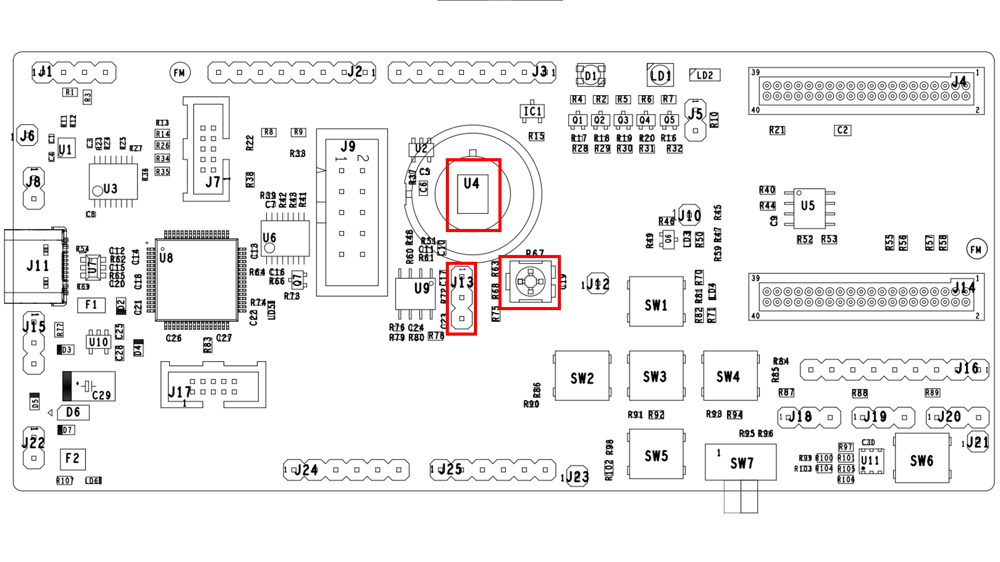

# Introduction

The Analog-to-Digital Converter (ADC) peripheral reference application
demonstrates the use of the built-in ADC to log temperature, battery voltage and one
of the Analogue Input Output (ANIO) channel voltages.

# Hardware Setup

  

# QPG6105 GPIO Configurations

The jumper J13 can be used to switch the ADC input ANIO0 between the potentiometer and the PIR sensor.
Verify the jumper is set to 1-2 ('POT').

| GPIO Name | Jumper setting | Connected To | Comments |
|:----------:|:----------:|:----------:|:---------|
| GPIO21| 1-2 | POT (R67)| ANIO0 jumper configured to use ADC input of the potentiometer. |
|| 2-3 | PIR Sensor (U4)| ANIO0 jumper configured to use ADC input of the PIR sensor. |

# Usage

After loading the program onto the board, the program starts to run:

-   Every 5 seconds, the application reads the ANIO0 channels and logs
    the values to UART.

-   Every 5 ANIO readings, the application will read and log the
    internal temperature value and voltage.

-   Changing the resistance of the potentiometer will trigger changes in
    values of the live measurement.

# Chip sleep and wakeup example

The application build configuration suffixed with _wkup will put the chip in a low-power sleep mode (indicated by LD3
being off).

When ANIO 0 reads a voltage larger than around 0.2V, the system will wake up.
