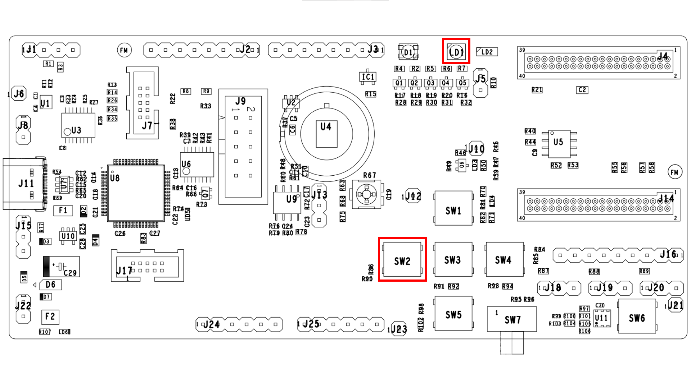

# Introduction

The Light Emitting Diode (LED) reference application demonstrates using
the LED Generator to control the intensity of the (cool) white LED.

# Hardware Setup

  

# QPG6105 GPIO Configurations

| GPIO Name| Direction| Connected To| Comments|
|:----------:|:----------:|:----------:|:---------|
| GPIO22| Input| SW2| Button|
| GPIO17| Output| LD1| White (cool) LED |

# Usage

After loading the program to the board and running:

-   A short press (&lt;300ms) on SW2 will toggle the White LED on and off

-   A long press (&gt;300ms) on SW2 will gradually increase or decrease
    the brightness of the White LED every 100ms.
