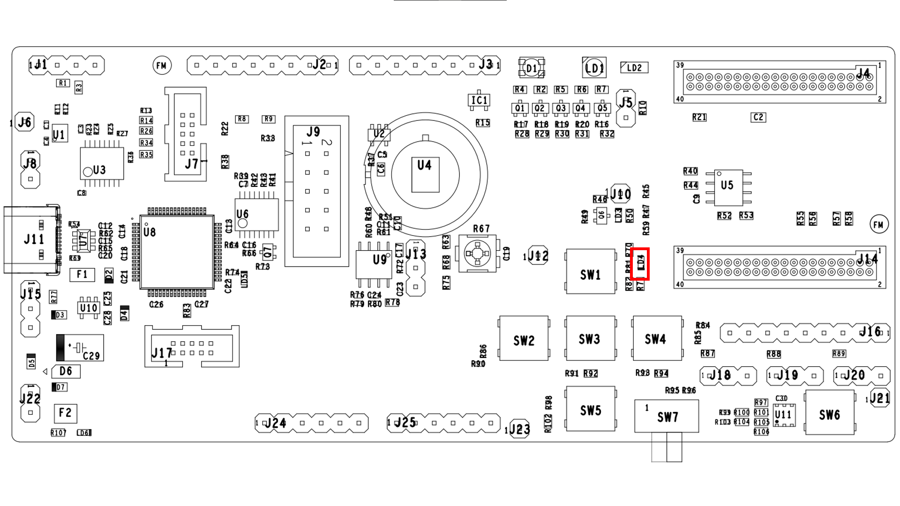

# Introduction

The Master Serial Peripheral Interface (MSPI) peripheral reference
application demonstrates using the MSPI to read and write data to an SPI
flash device.

# Hardware Setup

<div align="center">
  
</div>

# QPG6105 GPIO Configurations

| GPIO Name| Direction| Connected To| Test Pin| Comments|
|:----------:|:----------:|:----------:|:----------:|:---------|
| GPIO0| Output| LD4| -| Red LED|
| GPIO1| Output (SSn)| U5 (Pin 1)| TP19| Flash memory slave select|
| GPIO10| Output (SCLK)| U5 (Pin 6)| TP18| Flash memory SPI clock|
| GPIO11| Output (MOSI)| U5 (Pin 5)| TP20| Flash memory master out slave in (MOSI)|
| GPIO12| Output (MISO)| U5 (Pin 2)| TP21| Flash memory master in slave out (MISO)|

# Serial logging

For getting the serial logging for this application, the Qorvo tool Jadelogger needs to be used. It is used to send
and receive data from a Qorvo device. It is a serial/TCP terminal that uses a proprietary protocol to decode numbers,
offer additional context and increases robustness (using SYN). Jadelogger decodes this protocol and prints using
following format:

| Timestamp host | Module ID | Timestamp device | Log |
|:----------:|:----------:|:----------:|:---------|
| 2022-06-15 10:27:26.754| 01 | 0.051488| Reset Done |


To start Jadelogger, execute following command:

```
python3 QMatter/Tools/Jadelogger/gppy/tools/jadelogger.py /dev/ttyACM0:115200
```

Please note that the COM port number and device label **may differ** on your computer.

After resetting the programmed QPG6105 with the application (press the button `SW6 RADIO RESET`), you will see similar output as below:

```
2022-06-17-15:41:16.238  00 3.590821 NRT ROM v1
2022-06-17-15:41:16.238  00 3.590901 =====================
2022-06-17-15:41:16.245  00 3.597638 SPI master test application starting
2022-06-17-15:41:16.245  00 3.597713 =====================
2022-06-17-15:41:16.245  00 3.597741 =====================
2022-06-17-15:41:16.251  00 3.603301 Manufacturer Id 0x1f
2022-06-17-15:41:16.251  00 3.603364 Memory Type 0x85
2022-06-17-15:41:16.251  00 3.603395 Memory Capacity 0x1
2022-06-17-15:41:16.257  00 3.609395 Recognized manufacturer Adesto
2022-06-17-15:41:16.257  00 3.609529 Recognized device AT25SF081
2022-06-17-15:41:16.312  00 3.664523 =====================
2022-06-17-15:41:16.312  00 3.664651 =====================
2022-06-17-15:41:16.312  00 3.664688 TESTING MSPI - FLASH
2022-06-17-15:41:16.318  00 3.670387 =====================
2022-06-17-15:41:16.318  00 3.670477 No operation is in progress, SR : 0x0
2022-06-17-15:41:16.365  00 3.717858 Erasing sector at address 0x200
2022-06-17-15:41:16.374  00 3.726142 Test SPI single byte read/write at address 0x202
2022-06-17-15:41:16.374  00 3.726347 Test Single Byte, WriteByte : 0x5, ReadByte : 0x5
2022-06-17-15:41:16.391  00 3.743148 Test SPI block(multiple bytes) read/write at address 0x300
2022-06-17-15:41:16.498  00 3.850031 NrOfErrors=0
```

# Usage

After loading the program to the board and running:

-   The SPI flash device (AT25SF081) information is read back
    (Manufacturer ID, memory type and memory capacity).

-   A single byte is written to and read back from flash and logged.

-   A block of data is written to and read back from flash and logged.

-   The red LED (LD4) blinks for every flash read/write cycle.
