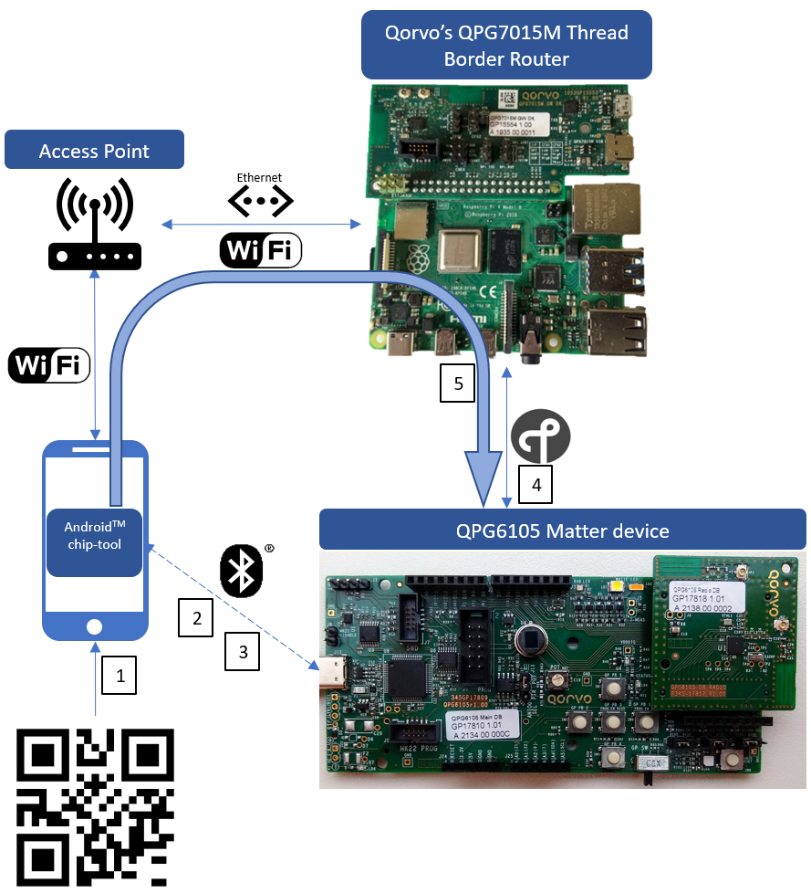
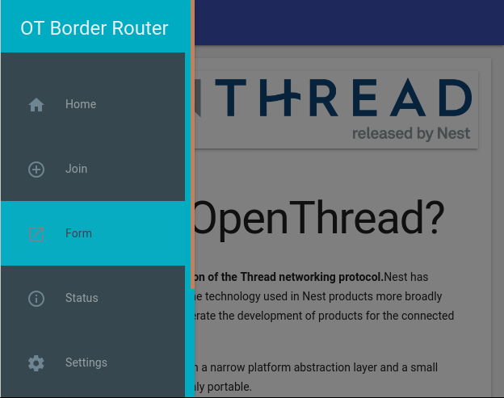
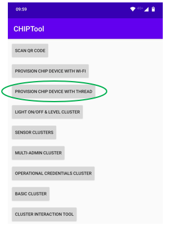
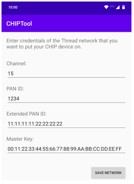
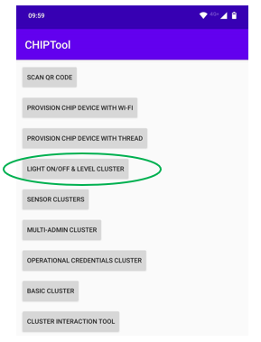
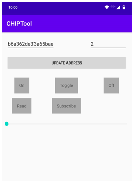

# Commissioning Qorvo Matter device with Android chip-tool

In this guide, step by step instructions are given to commission a Matter device onto the Matter network and control
it using the Android&trade; chip-tool.

> **WARNING:** the CHIPTool Android application is a development tool developed and maintained within the Matter
> community, its features are limited and do not represent a final product. It is still in a development phase so
> some instability while using the application might be seen.

The setup to be achieved will look like the picture below:

<div align="center">
  
</div>

To commission and control the Matter device in the network following actions will be done:
1) The smartphone scans the Matter device's QR code.
2) A secure Bluetooth LE connection is setup using the QR code information.
3) Thread network credentials are passed to the Matter device.
4) The Matter device joins the Thread network.
5) The smartphone can now communicate via IP over the QPG7015M based WiFi/Ethernet-Thread router and control the Matter
device.

Required Hardware:
- Qorvo's QPG7015M Gateway development kit.
- Qorvo's QPG6105 Matter development kit.
- Smartphone with Android 8 or later.
- Access point/Router to connect your Smartphone and Gateway development kit to the same network. Note that a WiFi Access
point can be enabled on the Raspberry Pi that runs the OpenThread Border Router. See [How to setup the OpenThread Border Router](setup_ot_borderrouter.md) how this can be achieved.

## Step 1: Installing Android chip-tool.

The Android chip-tool can be downloaded from [here](Tools/MatterControllers/Android). Transfer this apk to your smartphone and
install it. You may need to grant permission to install unknown applications.

Also make sure your smartphone is connected through WiFi in the same network as the OpenThread Border Router will
operate on.

## Step 2: Preparing OpenThread Border Router.

First make sure the OpenThread Border Router is set up as descibed in [How to setup the OpenThread Border Router](setup_ot_borderrouter.md). Verify it is connected through Ethernet or WiFi in the same network
as the smartphone. Once the OpenThread Border Router is up and running we can form a Thread network.
This can be achieved by browsing via the smartphone to the ip-address of the Raspberry Pi on which the OpenThread
Border Router is running.

Navigate to 'Form' via the menu on the left. If the menu is not displayed click 'Home' in the top left first.

<div align="center">
  
</div>

This will bring you to a new page where you can do some configuration of the OpenThread network. Leave the defaults and
click 'FORM':

<div align="center">
  
</div>

When prompted 'Are you sure you want to Form the Thread Network'. Click 'OKAY':

<div align="center">
  
</div>

After a few seconds a message should appear that the Thread network is formed correctly:

<div align="center">
  
</div>

Now a Thread network is created. Proceed to step 3 to prepare the Matter device for joining the network.

## Step 3: Preparing Matter device for commissioning.

Make sure the Matter software is flashed on the development kit and the serial console application is running. See
[Matter examples](../../README.md#matter-examples) if this is not done yet.

If you already commissioned the device before, perform a factory reset first. Performing factory reset is dependent on
the Matter device you are using:
- [Factory reset of the Matter Light](../../Applications/Matter/light/README.md#factory-reset)
- [Factory reset of the Matter Lock](../../Applications/Matter/lock/README.md#factory-reset)

After reset of the Matter light application, the device will start Bluetooth LE advertising automatically and is ready
for commissioning in the Matter network.

The Matter lock application does not start advertising automatically because of security reasons for a lock device,
therefore a manual trigger is needed to initiate advertising. Shortly press SW5 on the development board to trigger the
advertising. Now the Matter lock device is ready for commissioning in the Matter network.

## Step 4: Commissioning the Matter device in the Matter network.

> **WARNING:** Known issue of the chip-tool is that the application can’t be used anymore if it is pushed to the
> background or when the smartphone goes into sleep. To restore, you need to force kill the application using Android’s
> task manager and restart it.

Open Android chip-tool on the smartphone and click 'PROVISION CHIP DEVICE WITH THREAD':

<div align="center">
  
</div>

This will open the camera to scan the QR code. To retrieve the QR code you need to check the serial output of the
Matter device. This will print a URL at start-up where you can find the QR code. Output should be something similar as:

```
[P][SVR] https://dhrishi.github.io/connectedhomeip/qrcode.html?data=MT%3AY3.13AUB00KA0648G00
```

To display the QR code, open a web browser and navigate to the URL. This website generates the required QR code to
commission the device with.

Now make sure your Matter device is advertising (for the Matter light it starts advertising automatically after reset,
for the Matter lock, you need to press SW5 short to trigger the advertising). Next scan the QR code (action 1 in the
figure on top) and the chip-tool will start Bluetooth LE scanning to find the Matter device. If it finds the device, a
Bluetooth LE connection will be triggered (action 2 in the figure on top), and commissioning will start automatically.

After a few seconds, the Android chip-tool will ask you to enter the credentials of the Thread network. If you have used
the defaults during the formation of the Thread network on the Border Router, you can use the defaults here as well.
Otherwise make sure to update them accordingly.

<div align="center">
  
</div>

Now the Matter device will receive the Thread network credentials via Bluetooth LE (action 3 in the figure on top).
Finally, the Matter device will join the Thread network and the message 'commissioning completed' appears shortly at
the bottom of the screen.

Now the Matter device is fully commissioned in the Matter network and you can start controlling the Matter device using
the Android chip-tool. This will be explained in the next step.

## Step 5: Sending commands to control the Matter device in the network.

To start controlling the Matter device, navigate to 'LIGHT ON/OFF & LEVEL CLUSTER'.

<div align="center">
  
</div>

A slider, Toggle and ON/OFF controls are shown:

<div align="center">
  
</div>

You can now operate your Matter device using the controls:
- For Matter Light, it controls the RGB led on the development board (Dimming using the slider, Toggle and ON/Off
commands can be used).
- For Matter Lock, the lock is emulated using the cool white led (LD1) (Toggle and ON/OFF commands can be used, the
slider is not used for the lock application).

## Troubleshooting
- if the Android chip-tool crashes during commissioning, disable Bluetooth on the smartphone, then re-enable it again
before retrying. You can also try killing all applications running in the background using Android task manager.
- After a reset of the Matter device, trigger 'Update address' on the control screen. This will update the address again
in the Thread network.
- After a reset of the OpenThread border router, it is advised to reset the SRP server by executing following commands
in RPi's terminal:
```
docker exec -it otbr_docker_0 sudo ot-ctl srp server disable
docker exec -it otbr_docker_0 sudo ot-ctl srp server disable
```
Also trigger 'Update Address' on the control screen. This will update the address again in the Thread network.
- After a force kill of the application, trigger 'Update Address' on the light control screen. This will update the
address again in the Thread network.
