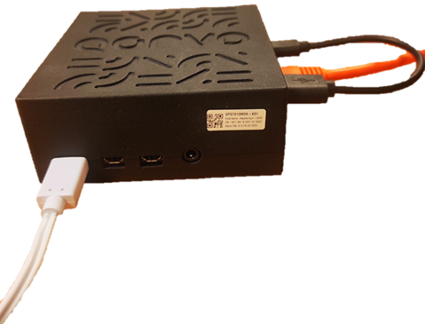

# Setup OpenThread Border Router on Qorvo's QPG7015M Gateway development kit

In this guide, step by step instructions are given to setup an OpenThread Border Router, using Qorvo's QPG7015M Gateway Development Kit.
This enables the user to set up a Matter network and control Matter devices over Wi-Fi/ethernet with the QPG7015M operating as an OpenThread Border Router, using the [Android chip-tool](commissioning_android_chiptool.md), or the [POSIX CLI chip-tool](commissioning_posix_cli_chiptool.md).

Required Hardware:
- Access point/Router to connect your QPG7015M Gateway development kit to a local area network (LAN).
- Qorvo's QPG7015M Gateway development kit:

<div align="center">
  
</div>

## Index

1. [Step 1: Establish access to the QPG7015M Gateway Development Kit](#step-1-establish-access-to-the-qpg7015m-development-kit)
2. [Step 2: Configure the QPG7015M Gateway Development Kit for OpenThread Border Router](#step-2-configure-the-qpg7015m-gateway-development-kit-for-openthread-border-router)
3. [Step 3: Start the OpenThread Border Router](#step-3-start-the-openthread-border-router)
4. [Step 4: Stop the OpenThread Border Router](#step-4-stop-the-openthread-border-router)
5. [Step 5: Factory reset the OpenThread Border Router](#step-5-factory-reset-the-openthread-border-router)


## Step 1: Establish access to the QPG7015M Gateway Development Kit

Described in the section "[Accessing the QPG7015M Gateway Development Kit's terminal](./setup_qpg7015m_dk.md#accessing-the-qpg7015m-gateway-development-kits-terminal)" of the QPG7015M Gateway DK Setup guide.

## Step 2: Configure the QPG7015M Gateway Development Kit for OpenThread Border Router

How to edit the configuration file is described in the section "[Configure the QPG7015M Gateway Development Kit](./setup_qpg7015m_dk.md#configure-the-qpg7015m-gateway-development-kit)" of the QPG7015M Gateway DK Setup guide.
In [Stack configuration](./setup_qpg7015m_dk.md#stack-configuration) disable the unwanted stacks and enable following parameters:

```shell
QORVO_OT_BR=1
QORVO_OT_BRBB_INTERFACE=wlan0
```

## Step 3: Start the OpenThread Border Router

Now the QPG7015M Gateway Development Kit, must be started to run with the configuration set in [Step 2](#step-2-configure-the-qpg7015m-gateway-development-kit-for-openthread-border-router).
This is described in the section "[Start the QPG7015M Gateway Development Kit](./setup_qpg7015m_dk.md#start-the-qpg7015m-gateway-development-kit)" of the QPG7015M Gateway DK Setup guide.
Make sure you see following logging:

```shell

Loading ot-br docker image from file!
3a7cc06ad581: Loading layer [==================================================>]  48.07MB/48.07MB
57fa7918522d: Loading layer [==================================================>]  81.91MB/81.91MB
d626ab464e19: Loading layer [==================================================>]  197.7MB/197.7MB
Loaded image: connectedhomeip/otbr:te7
55dbfafd48f5297dbceb19d76e407d873e6657bf47de246908a705515164f9ba
Gateway does not start automatically at boot

-------

Docker container otbr_docker_0 is running and Up 6 seconds.

You can now start ot-ctl command-line utility, and get logs by entering the following commands:

docker exec -it otbr_docker_0 ot-ctl
docker logs otbr_docker_0

-------
GATEWAY STARTED AND READY TO USE!

```

The OpenThread Border Router launches a Wi-Fi Access Point `BorderRouter-AP` with password `Qorvo_QPG7015M`. The user is now able to access the OpenThread Border Router via its IP address or hostname on a device that's connected to that Wi-Fi Access point. Matter devices can be joined to the network using the [Android chip-tool](commissioning_android_chiptool.md) or the [POSIX CLI chip-tool](commissioning_posix_cli_chiptool.md).

The OpenThread Border Router IP address can be found by running this command on the raspberry pi:

```shell
pi@raspberrypi:~ $ ip a show dev wlan0
3: wlan0: <BROADCAST,MULTICAST,UP,LOWER_UP> mtu 1500 qdisc pfifo_fast state UP group default qlen 1000
    link/ether dc:a6:32:ac:dc:de brd ff:ff:ff:ff:ff:ff
    inet 192.168.2.2/24 brd 192.168.2.255 scope global wlan0
       valid_lft forever preferred_lft forever
    inet 169.254.183.97/16 brd 169.254.255.255 scope global noprefixroute wlan0
       valid_lft forever preferred_lft forever
    inet6 2001:db8:2:0:dea6:32ff:feac:dcde/64 scope global dynamic mngtmpaddr
       valid_lft 86372sec preferred_lft 14372sec
    inet6 fe80::44b2:ea3f:5f02:79d3/64 scope link
       valid_lft forever preferred_lft forever

```

In the example output above, the ipv4 address 192.168.2.2 can be used.

## Step 4: Stop the OpenThread Border Router

This is described in the section "[Stop the QPG7015M Gateway Development Kit](./setup_qpg7015m_dk.md#stop-the-qpg7015m-gateway-development-kit)" of the QPG7015M Gateway DK Setup guide.
Stopping the DK will **NOT** delete the info of the joined devices.

## Step 5: Factory reset the OpenThread Border Router

This is described in the section "[Reset the QPG7015M Gateway Development Kit](./setup_qpg7015m_dk.md#factory-reset-the-qpg7015m-gateway-development-kit)" of the QPG7015M Gateway DK Setup guide.
This action **WILL** delete the info of all joined devices.
Pay attention to following logging:

```shell
pi@[hostname]:~ $ ./factory_reset_gateway.sh
FACTORY RESETTING GATEWAY...
STOPPING GATEWAY...

...

Total reclaimed space: 0B
Deleted Images:
untagged: connectedhomeip/otbr:te7
deleted: sha256:ba054de35dcad1ffaf528a028f2310411f24715880cef036f8351cfbebeb5bfd
deleted: sha256:b033431b9748e9f80ee127caf8596b3a5746cc44d7165ed94f98cef8a9eb8797
deleted: sha256:f8263691911c51510a7fe67946455f6a068093a0249acbfba1f6365e9eeea937
deleted: sha256:3a7cc06ad5817e6e36c96383ae1de75e1c9fc86fcb1fa65892fb30c7194a096e

Total reclaimed space: 318.1MB
GATEWAY IS FACTORY RESET!
```
