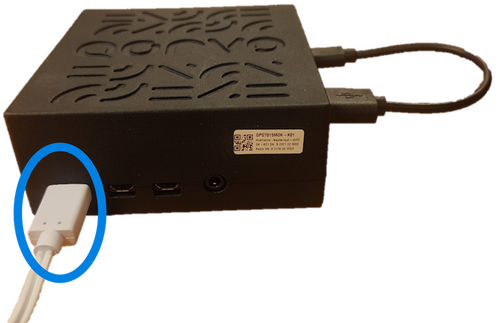
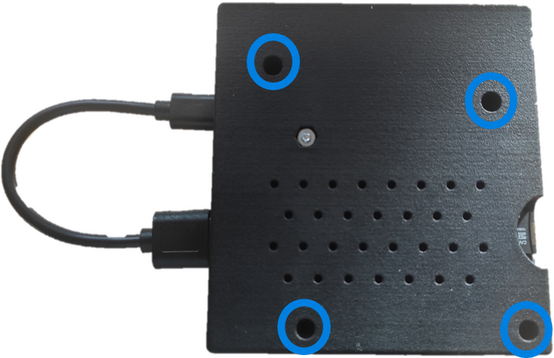
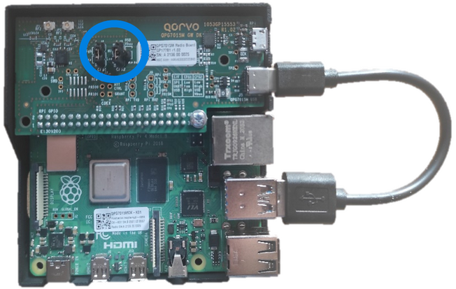
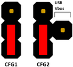

# Setup Qorvo's QPG7015M Gateway development kit
In this guide, step by step instructions are given to setup up Qorvo's QPG7015M Gateway Development Kit (DK).

Required Hardware:
- Qorvo's QPG7015M Gateway development kit:
    + 1 QPG7015M Radio Board
    + 1 Raspberry Pi 4 single board computer
    + 1 Raspberry Pi 4 Power supply
    + 1 USB C to USB A cable

<div align="center">
  
</div>

## Index

1. [Accessing the QPG7015M Gateway Development Kit's terminal](#accessing-the-qpg7015m-gateway-development-kits-terminal)
2. [Configure the QPG7015M Gateway Development Kit](#configure-the-qpg7015m-gateway-development-kit)
3. [Start the QPG7015M Gateway Development Kit](#start-the-qpg7015m-gateway-development-kit)
4. [Stop the QPG7015M Gateway Development Kit](#stop-the-qpg7015m-gateway-development-kit)
5. [Factory reset the QPG7015M Gateway Development Kit](#factory-reset-the-qpg7015m-gateway-development-kit)

## Accessing the QPG7015M Gateway Development Kit's terminal

The QPG7015M Gateway DK comes with a power supply to power the device. Insert the power supply in the USB C port on the front of the QPG7015M Gateway DK. This side is indicated by the label and shown in [the image below](../Images/qpg7015m_dk_power_supply.png). 
<div align="center">
  
</div>

Access to the QPG7015M Gateway Development Kit terminal is required to configure, start and stop applications.
There are two options to access the terminal of the QPG7015M Gateway Development Kit:

- Secure Shell (SSH): Connect the QPG7015M DK to your local area network using an ethernet cable.  From a computer that has an SSH client application installed the QPG7015M DK can be accessed over SSH by running from a command prompt (Windows) or terminal (Linux):

```shell
ssh pi@raspberrypi-<last 4 digits of the radio board its serial number>
```
The hostname can be found on the casing as depicted in [the image above](../Images/qpg7015m_dk_casing.png). The user of the QPG7015M DK is *pi*, the password is *raspberry*.
In this example the hostname is `raspberrypi-db99`.

- Keyboard and screen: Connect a USB keyboard to any of the USB A ports of the QPG7015M DK and attach a screen to a High-Definition Multimedia Interface (HDMI) Micro port. Please ensure the screen is connected before applying power to the QPG7015M DK. The user of the QPG7015M DK is *pi*, the password is *raspberry*. If for some reason the hostname cannot be accessed over ethernet, this is an option to retrieve the IP address running:
```shell
ifconfig
```

## Configure the QPG7015M Gateway Development Kit

The QPG7015M Gateway Development Kit comes preinstalled with several communication stacks and example applications. These can each be enabled or disabled pending on the user preference using a configuration file: `qorvo_stack_config`.
The configuration file is located in the home directory: `/home/pi`.
From a terminal, the user can modify the configuration file by running:

```shell
sudo nano qorvo_stack_config
```

To save the file run `ctrl + o` followed by `ctrl + x`.

The file exists out of several sections:

### Communication Interface Configuration

```shell
# HARDWARE CONFIGURATION
#------

# Qorvo chip
QORVO_CHIP="QPG7015M"

# Qorvo host interface selection
#                                       "USB"
#                                       "SPI" (default)
# QORVO_HOST_INTERFACE="SPI"
```

The QPG7015M supports two interface protocols: USB and SPI. By default Serial Peripheral Interface (SPI) is configured. Changing the interface protocol is done by modifying the qorvo_stack_config file AND modifying the jumper configuration on the QPG7015M Gateway DK.

#### Access jumper configuration

To open the QPG7015M Gateway DK, remove the [4 screws](../Images/qpg7015m_dk_screws.png) on the bottom with a cross tip screwdriver. No need to remove the nut. Afterwards the top of the plastic casing can be removed.

<div align="center">
  
</div>

The jumpers CFG1 and CFG2 can be found by opening the case. They're shown in [the image below](../Images/qpg7015m_radio_board_cfg1_cfg2.png)

<div align="center">
  
</div>


#### Set SPI in configuration file

To enable SPI, the user must set the the QORVO_HOST_INTERFACE in the qorvo_stack_config file as such:

```shell
QORVO_HOST_INTERFACE="SPI"
```


#### Set jumpers to SPI

Additionally, the user needs to set the correct HW configuration. 
The jumpers for CFG1 and CFG2 need to be set as shown in [the SPI jumper configuration](../Images/pin_cfg_spi.png)

<div align="center">
  
</div>

#### Set USB in configuration file

To enable the Universal Serial Bus (USB) interface, the user must configure the QORVO_HOST_INTERFACE as such:

```shell
QORVO_HOST_INTERFACE="USB"
```

#### Set jumpers to USB

Aditionally the jumpers for CFG1 and CFG2 need to be set as shown in [the USB jumper configuration](../Images/pin_cfg_usb.png).
The user will also need to connect the USB C to USB A cable, show on [the image of the QPG7015M DK](../Images/qpg7015m_dk_casing.png)

<div align="center">
  
</div>

### Application location on the filesystem

These parameters are used to give input to the Qorvo startup, stop and reset scripts about the path of the application executables and kernel drivers on the filesystem.
> **WARNING:** These locations should not be changed when using the QPG7015M Gateway Development Kit, but can be modified when building a custom filesystem when porting the QPG7015M DK SW to a custom platform.


```
# LOCATIONS
#------

# ZigBee 3.0 stack location: "ZigBee3.0" (default)
#                            "ZigBee3.0_OSHS"
# QORVO_ZB3="ZigBee3.0"

# OpenThread stack location:            "OpenThread" (default)
# QORVO_OPENTHREAD="OpenThread"

# Ble stack location:                   "Bluetooth_LE" (default)
# QORVO_BLE="Bluetooth_LE"

# FirmwareUpdater location:            "FirmwareUpdater" (default)
# QORVO_FIRMWAREUPDATER="FirmwareUpdater"

# Firmware image location:      "${QORVO_FIRMWAREUPDATER}/Firmware_${QORVO_CHIP}${QORVO_DEBUG_POSTFIX}.hex" (default)
# QORVO_FW_IMAGE="FirmwareUpdater/Firmware_QPG7015M.hex"

# Qorvo drivers location:               "Drivers" (default)
# QORVO_DRIVERS="Drivers"

# Qorvo Driver Path string:             "${QORVO_DRIVERS}/${RUNTIME_PI_MODEL}/${RUNTIME_KERNEL_VERSION}/${QORVO_CHIP}${QORVO_DRIVER_EXT}" (default)
# QORVO_DRIVER_PATH="Drivers/RPi4/5.10.17-v7l+-qorvo/QPG7015M_RPi4"

# Qorvo socket IPC location:            "/dev/socket" (default)
# QORVO_SOCKET_IPC="/dev/socket"

# PTC location:                   "Ptc" (default)
# QORVO_PTC_APP="Ptc"

# CTC location:                   "Ctc" (default)
# QORVO_CTC_APP="Ctc"

# Override Osal Driver kernel module name:     "OsalDriver${QORVO_DRIVER_EXT}" (default)
# OSAL_DRIVER=""

# Override OsalOem Driver kernel module name:  "OsalOemDriver_${QORVO_CHIP}${QORVO_FEM}${QORVO_DRIVER_EXT}" (default)
# OSALOEM_DRIVER=""

# Override App Driver kernel module name:      "DrvComKernel_${QORVO_CHIP}${QORVO_FEM}${QORVO_DRIVER_EXT}" (default)
# APP_DRIVER=""

```

### Stack configuration

The stack configuration section is used to configure which communication stacks will be loaded at startup. Combinations of these protocols are possible.

```shell
# STACK CONFIGURATION
#------

# Enable ZigBee 3.0 stack:                  0
#                                           1 (default)
# QORVO_ZIGBEE=1

# Enable Thread stack (CLI):                0 (default)
#                                           1
# QORVO_OT_CLI=0

# Enable OpenThread Border Router:          0 (default)
#                                           1
# QORVO_OT_BR=0

# OpenThread Border Router Backbone Interface         
#                                          eth0 (default)
#                                          wlan0
# QORVO_OT_BRBB_INTERFACE=eth0

# Enable Bluetooth LE (Host) stack:         0
#                                           1 (default)
# QORVO_BLUETOOTHLE=1

# When QORVO_BLUETOOTHLE and one of the 802.15.4 stacks (QORVO_ZIGBEE or QORVO_OT_CLI or QORVO_OT_BR) is enabled, the QPG7015M will be configured in 
# ConcurrentConnect mode. In ConcurrentConnect mode, the radio will be able to concurrently do BLE scanning and listen to a single 
# 802.15.4 channel. 
# If no BLE scanning is required, disable the configuration below to configure the QPG7015M in multi-channel mode, allowing the Thread 
# and Zigbee stack to operate on separate channels. See GP_P1053_UM_17952_Multi_Protocol_Configuration.pdf for more information.
#                                           0 
#                                           1 (default)
# QORVO_BLUETOOTHLE_SCANNING=1
```

Some additional parameters are also available here:

- The OpenThread Border Router has two possibilities:

1. Ethernet, the Border Router is now part of the network it is wired to.

```
QORVO_OT_BRBB_INTERFACE=eth0
```

2. Wi-Fi, the Border Router will form a new network named `BorderRouter-AP`, with password `Qorvo_QPG7015M`. The Border Router can be accessed by connecting over Wi-Fi to this new network.

```
QORVO_OT_BRBB_INTERFACE=wlan0
```

- When the user has configured **Bluetooth&reg;** Low Energy as active, it is also required to specify if background scanning is required (for instance when the application is running a **Bluetooth&reg;** LE central use case or is scanning for beacons).
Enabling **Bluetooth&reg;** LE scanning while at least one IEEE802.15.4 protocol is enabled will enable Qorvo's ConcurrentConnect&trade; functionality.
ConcurrentConnect&trade; enables concurrently listening to a **Bluetooth&reg;** LE advertising channel (i.e. for scanning) and an IEEE802.15.4 channel (i.e. for Zigbee or Thread).

```
QORVO_BLUETOOTHLE_SCANNING=0
```

### SOFTWARE CONFIGURATION

This section enables additional configuration for the software.

```
# SOFTWARE CONFIGURATION
#------

# Qorvo Configuration File Path string:  "" (default) = /etc
# QORVO_CONFIG_PATH=""

# Qorvo Startup XML File string:        "" (default) = "start.xml"
# QORVO_STARTUP_XML=""

# Qorvo SUDO string:                    "sudo" (default)
#                                       "NONE" no sudo
# QORVO_SUDO="sudo"

# Enable debugging options:             0 (default)
#                                       1
# QORVO_DEBUG=0

# Enable crash dumps:                   1 (default)
#                                       0
# QORVO_CRASHREPORT=1


# Enable Direct Test Mode               0 (default)
#                                       1
# QORVO_DTM=0

# Configurable interference threshold for channel selection.
# The gateway scans RF energy levels at startup to select a channel.
# Channels with energy level above this threshold will not be considered.
#
# Range 0 to 255 (0: -95 dBm, 254: -45 dBm, 255: threshold disabled).
# The recommended setting is 192.
# Do not change this unless the gateway must be specifically tuned for noisy environments.
# QORVO_INTERFERENCE_THRESHOLD="192"

# Start Gateway at boot:                0 (default)
#                                       1
# QORVO_GW_AT_BOOT=0

# Dump COM packets in file              0 (default)
#                                       1
# QORVO_COMDUMP=0

```

Three categories:

1. Zigbee Coordinator configuration

```
QORVO_CONFIG_PATH=""
QORVO_STARTUP_XML=""
```

These parameters indicate where to find the default start configuration of the Zigbee Coordinator 

2. Debug logging

```
QORVO_DEBUG=0
```

This parameter shows additional logging of the firmware and the kernel drivers in the kernel logging accessible via `dmesg`.

3. Crash report generation

```
QORVO_CRASHREPORT=1
```

This parameter generates a report when the QPG7015M Gateway DK crashes. These reports are stored at `/home/pi`.

4. Host<>Controller traffic dump

```
QORVO_COMDUMP=0
```

This parameter captures all traffic between the host and controller and stores it in `~/Logs`. The required application is not by default present on the QPG7015M Gateway DK and must be build from its source package. After building `ComDumpTool_RPi.elf` make sure it is in the correct folder:

```
pi@[hostname]:~ $ mkdir ComDumpTool
pi@[hostname]:~ $ mv ComDumpTool_RPi.elf ComDumpTool/
```

> **WARNING:** ComDumpTool has an impact on the performance and should be used only during development for debug purposes.

5. **Bluetooth&reg;** LE Direct Test Mode

```
# QORVO_DTM=0
```

These parameters enables **Bluetooth&reg;** LE Direct Test Mode. This mode is used for Bluetooth&reg; LE certifications and cannot be combined with other active stacks.

6. Interference Threshold

```
# QORVO_INTERFERENCE_THRESHOLD="192"
```

This parameter configures the energy detect threshold used by the Zigbee stack to pick the correct channel. Its range is from 0 to 255 and is linear with the measures power. (0: -95 dBm, 254: -45 dBm, 255: threshold disabled). The recommended setting is 192.

> **WARNING:** Do not change this unless the gateway must be specifically tuned for noisy environments.

7. Start gateway at boot

```
# QORVO_GW_AT_BOOT=0
```

This setting will automatically start the Qorvo QPG7015M drivers and applications upon boot. The startup behavior described in [section 3](#start-the-qpg7015m-development-kit) will be automatically triggered.

> **WARNING:** All configurations are enabled when running the start_gateway.sh script. Meaning that disabling this feature also requires to run this script after configuration.

## Start the QPG7015M Gateway Development Kit

To start the QPG7015M Gateway Development Kit with the configuration set in [section 2](#configure-the-qpg7015m-gateway-development-kit), Qorvo provides a script called start_gateway.sh.
When executing the script, expect following logging (qorvo_stack_config set to the default settings):

```
pi@[hostname]:~ $ ./start_gateway.sh 
CONFIGURING GATEWAY SERVER...
Please don't stop the process, This can take a few minutes.
Run time configuration:
QORVO_CHIP=QPG7015M
QORVO_DRIVER_EXT=_RPi4
QORVO_ZB3=ZigBee3.0
QORVO_HOST_INTERFACE=SPI
QORVO_BLE=Bluetooth_LE
QORVO_FIRMWAREUPDATER=FirmwareUpdater
QORVO_FW_IMAGE=FirmwareUpdater/Firmware_QPG7015M.hex
QORVO_PTC=0
QORVO_CTC=0
QORVO_PTC_APP=Ptc
QORVO_CTC_APP=Ctc
QORVO_BOARDCONFIG_DIR=/home/pi/BoardConfigTool
QORVO_BOARDCONFIG_BIN=BoardConfigTool_RPi.elf
QORVO_DRIVERS=Drivers
QORVO_DRIVER_PATH=Drivers/RPi4/5.10.17-v7l+-qorvo/QPG7015M_RPi4
OSAL_DRIVER=OsalDriver_RPi4
OSALOEM_DRIVER=OsalOemDriver_QPG7015M_SPI_RPi4
APP_DRIVER=DrvComKernel_QPG7015M_SPI_RPi4
QORVO_ZIGBEE=1
QORVO_OT_CLI=0
QORVO_OT_BR=0
QORVO_OPENTHREAD=OpenThread
OPENTHREAD_CLI=qpg7015m-ot-cli-ftd.elf
OPENTHREAD_RCP=qpg7015m-ot-rcp.elf
QORVO_COMDUMP=
QORVO_CONFIG_PATH=
QORVO_STARTUP_XML=
QORVO_SUDO=sudo
QORVO_DEBUG=0
QORVO_INTERFERENCE_THRESHOLD=192
QORVO_GW_AT_BOOT=0
QORVO_SOCKET_IPC=/dev/socket
QORVO_MAC_NVM_PATH=/etc/mac/macNvm.dat
APP_DRIVER_DEFAULT=DrvComKernel_QPG7015M_SPI_RPi4
Copied zgdd factory block
STARTING GATEWAY SERVER...
  PID TTY      STAT   TIME COMMAND
  941 ?        Ss     0:00 /lib/systemd/systemd --user
  942 ?        S      0:00 (sd-pam)
  957 ?        S      0:00 sshd: pi@pts/0
  958 pts/0    Ss     0:00 -bash
 1696 pts/0    S+     0:00 /bin/sh ./start_gateway.sh
 1699 pts/0    S+     0:00 /bin/sh ./qorvo_stack_init start
 1783 pts/0    S+     0:00 /bin/sh ./qorvo_stack_init start
 1784 pts/0    S+     0:00 sleep 1
 1786 pts/0    R+     0:00 ps x
DrvComKernel_QPG7015M_SPI_RPi4 module is not loaded.
OsalOemDriver_QPG7015M_SPI_RPi4 module is not loaded.
OsalDriver_RPi4 module is not loaded.
Loading OsalDriver_RPi4 ...
Loading GreenPeak Drivers/RPi4/5.10.17-v7l+-qorvo/QPG7015M_RPi4/OsalDriver_RPi4.ko for  (/dev/gp) kernel module...
No dev node created for module
Loading OsalOemDriver_QPG7015M_SPI_RPi4 ...
Loading GreenPeak Drivers/RPi4/5.10.17-v7l+-qorvo/QPG7015M_RPi4/OsalOemDriver_QPG7015M_SPI_RPi4.ko for  (/dev/gp) kernel module...
No dev node created for module
Loading DrvComKernel_QPG7015M_SPI_RPi4 ...
Loading GreenPeak Drivers/RPi4/5.10.17-v7l+-qorvo/QPG7015M_RPi4/DrvComKernel_QPG7015M_SPI_RPi4.ko for  (/dev/gp) kernel module...
17:32:11:537 01 ============================
17:32:11:537 01 FirmwareUpdater
17:32:11:537 01 vX.X.X.X Change:XXXXXX
17:32:11:538 01 ============================
17:32:11:538 01 loading FirmwareUpdater/Firmware_QPG7015M.hex
17:32:11:684 01 INFO: Bootloader reports ready and valid
17:32:11:685 01 Bootloader is active
17:32:11:685 01 Bootloader Stage 2: v0.9.2.6 Change:151145
17:32:11:685 01 Bootloader Stage1: version data unavailable (request not supported by this stage2 bootloader)
17:32:11:685 01 ProductId: QPG7015
17:32:11:685 01 IEEE 15.4 MAC: XX:XX:XX:XX:XX:XX
17:32:11:685 01 BLE MAC: XX:XX:XX:XX:XX:XX
17:32:11:697 01 Verifying CRC...
17:32:12:300 01 image matches
17:32:12:300 01 Starting application...
17:32:17:329 01 Received cbDeviceReady from firmware
17:32:17:329 01 Firmware update SUCCEEDED vX.X.X.X Change:XXXXXX
Firmware update finished successfully (0) ...
Firmware STARTING ...
gateway not running - starting!
NOTICE: Enabling ConcurrentConnect mode
17:32:17:350 01 Settings applied
17:32:17:351 01 Enabling concurrentconnect mode
zgdd: no process found
lrwx------ 1 pi pi 64 Dec 28 17:32 0 -> /tmp/zgdd_input
Copying template start.xml to tmp_start.xml for keeping (tmp_start.xml gets deleted after it was used).
Gateway does not start automatically at boot

-------
WARNING! Enabling 802.15.4 (Zigbee or Thread) and Bluetooth LE scanning (central or observer) requires additional configuration!!!
-------
Combining 802.15.4 (Zigbee or Thread) and Bluetooth LE scanning (central or observer) limits the 802.15.4 protocols to a single common channel.
See GP_P1053_UM_17952_Multi_Protocol_Configuration.pdf for more information.
If you are using only BLE peripheral functionality, the two 802.15.4 stacks can have different channels if QORVO_BLUETOOTHLE_SCANNING=0 is added to qorvo_stack_config.
If you are combining Bluetooth LE scanning with 2 802.15.4 stacks, you may have to update the individual stack channel configuration to fix the two 802.15.4 stacks to a single channel.

You can retrieve the configured channel of a previously used stack this way:
* OpenThread: on ot-cli or ot-ctl issue the 'channel' command
* ZigBee: check the inventory>gateway XML node's channel attribute in/etc/facilityd/inventory.xml (see GP_P332_AN_12712_Smart_Home_Gateway_XML_Files.pdf)
To change the channel the 802.15.4 stack is using, you can use:
* OpenThread: on ot-cli or ot-ctl issue the 'channel' command
* ZigBee: modify the channelmask in ZigBee3.0/start.xml and issue a factory reset
-------
-------

OPENING ENROLLMENT WINDOW FOR 380 SECONDS WITH PINCODE 1234...
NOTE THAT AUTHENTICATION IS REQUIRED ONLY FOR EXTERNAL CONNECTIONS.

You can now start the Smart Home Gateway Client, by entering the following command:

cd ZigBee3.0 && LD_LIBRARY_PATH=/home/pi/ZigBee3.0/lib ./SmartHomeGatewayClient_RPi.elf connect --host=localhost --port=8888

-------

You can now start the BLE stack, by entering the following command:

cd Bluetooth_LE && ./Bluetooth_LE_Test_Qorvo_rpi.elf
-------
GATEWAY STARTED AND READY TO USE!

```

## Stop the QPG7015M Gateway Development Kit

To stop the QPG7015M Gateway Development Kit, Qorvo provides a script called stop_gateway.sh, which must be executed.
Running this script will **NOT** delete the info of bonded or joined devices.

```
pi@[hostname]:~ $ ./stop_gateway.sh
STOPPING GATEWAY...
Unloading DrvComKernel_QPG7015M_SPI_RPi4 ...
found Drivers/RPi4/5.10.17-v7l+-qorvo/QPG7015M_RPi4/DrvComKernel_QPG7015M_SPI_RPi4.ko
Unloading GreenPeak 'Drivers/RPi4/5.10.17-v7l+-qorvo/QPG7015M_RPi4/DrvComKernel_QPG7015M_SPI_RPi4.ko' kernel module...
Unloading OsalOemDriver_QPG7015M_SPI_RPi4 ...
found Drivers/RPi4/5.10.17-v7l+-qorvo/QPG7015M_RPi4/OsalOemDriver_QPG7015M_SPI_RPi4.ko
Unloading GreenPeak 'Drivers/RPi4/5.10.17-v7l+-qorvo/QPG7015M_RPi4/OsalOemDriver_QPG7015M_SPI_RPi4.ko' kernel module...
Unloading OsalDriver_RPi4 ...
found Drivers/RPi4/5.10.17-v7l+-qorvo/QPG7015M_RPi4/OsalDriver_RPi4.ko
Unloading GreenPeak 'Drivers/RPi4/5.10.17-v7l+-qorvo/QPG7015M_RPi4/OsalDriver_RPi4.ko' kernel module...
```

## Factory reset the QPG7015M Gateway Development Kit

To stop and factory reset the QPG7015M Gateway Development Kit, Qorvo provides a script called factory_reset.sh, which must be executed.
Running this script **WILL** delete the info of bonded or joined devices.

```
FACTORY RESETTING GATEWAY...
STOPPING GATEWAY...
Unloading DrvComKernel_QPG7015M_SPI_RPi4 ...
found Drivers/RPi4/5.10.17-v7l+-qorvo/QPG7015M_RPi4/DrvComKernel_QPG7015M_SPI_RPi4.ko
Unloading GreenPeak 'Drivers/RPi4/5.10.17-v7l+-qorvo/QPG7015M_RPi4/DrvComKernel_QPG7015M_SPI_RPi4.ko' kernel module...
Unloading OsalOemDriver_QPG7015M_SPI_RPi4 ...
found Drivers/RPi4/5.10.17-v7l+-qorvo/QPG7015M_RPi4/OsalOemDriver_QPG7015M_SPI_RPi4.ko
Unloading GreenPeak 'Drivers/RPi4/5.10.17-v7l+-qorvo/QPG7015M_RPi4/OsalOemDriver_QPG7015M_SPI_RPi4.ko' kernel module...
Unloading OsalDriver_RPi4 ...
found Drivers/RPi4/5.10.17-v7l+-qorvo/QPG7015M_RPi4/OsalDriver_RPi4.ko
Unloading GreenPeak 'Drivers/RPi4/5.10.17-v7l+-qorvo/QPG7015M_RPi4/OsalDriver_RPi4.ko' kernel module...
GATEWAY IS FACTORY RESET!
```
